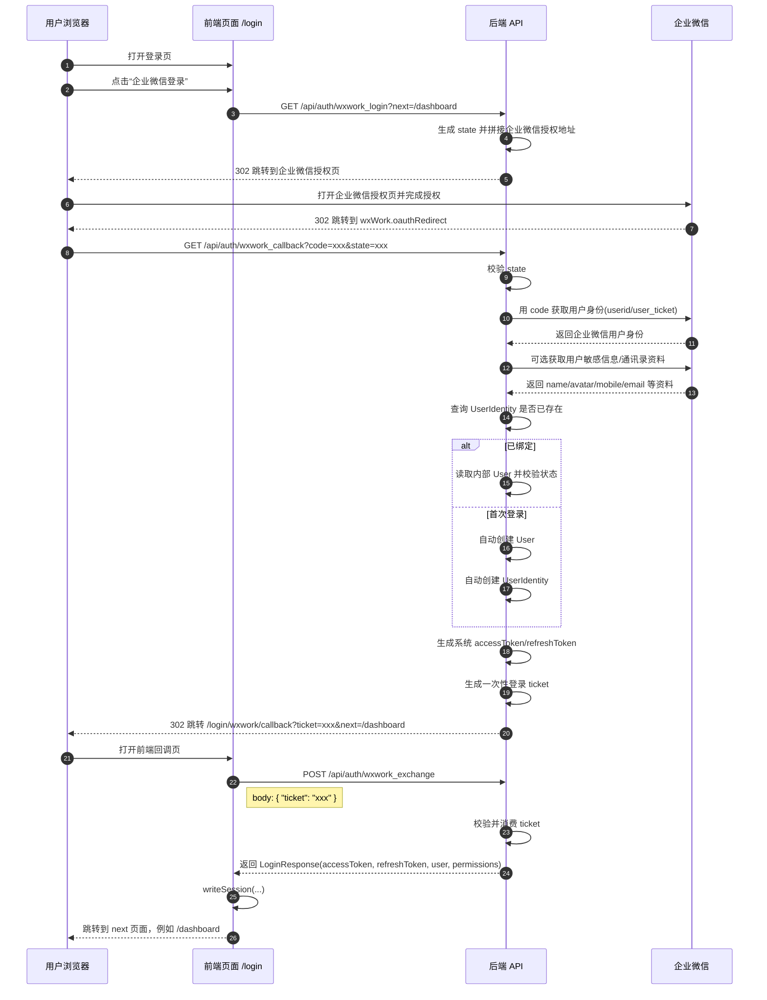
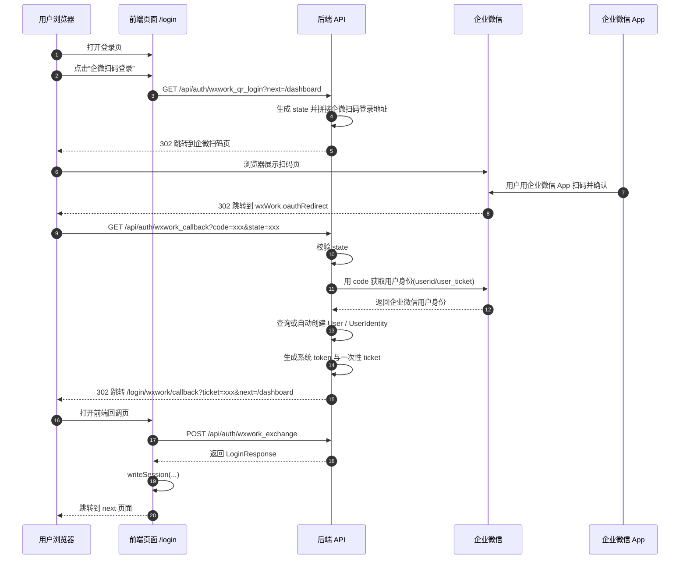

# 企业微信登录流程

本文说明当前项目中“企业微信登录”的双模式链路，以及浏览器、前端、后端、企业微信之间的接口调用顺序。

## 相关接口

- `GET /api/auth/wxwork_login`
  - 作用：生成“企微内网页授权登录”地址，并由后端 `302` 跳转到企业微信授权页
- `GET /api/auth/wxwork_qr_login`
  - 作用：生成“企微扫码登录”地址，并由后端 `302` 跳转到企业微信扫码页
- `GET /api/auth/wxwork_callback`
  - 作用：接收企业微信回调 `code/state`，完成系统内登录，生成一次性 `ticket`
- `POST /api/auth/wxwork_exchange`
  - 作用：前端用 `ticket` 换取系统自己的 `accessToken/refreshToken`

## 两种登录模式

### 1. 企微内网页登录

适用场景：

- 从企业微信工作台进入页面
- 在企业微信内置浏览器中打开后台

入口接口：

- `GET /api/auth/wxwork_login`

### 2. 企微扫码登录

适用场景：

- PC 普通浏览器访问后台登录页
- 不在企业微信内打开，但希望用企业微信扫码完成登录

入口接口：

- `GET /api/auth/wxwork_qr_login`

## 关键配置

- `wxWork.enabled`
- `wxWork.corpId`
- `wxWork.corpSecret`
- `wxWork.agentId`
- `wxWork.oauthRedirect`
- `wxWork.stateSecret`

其中 `wxWork.oauthRedirect` 必须配置为后端可访问的完整地址，例如：

```yaml
wxWork:
  oauthRedirect: "https://your-domain.com/api/auth/wxwork_callback"
```

## 登录时序图

### 企微内网页登录时序



### 企微扫码登录时序



## 后端内部处理说明

### 1. `GET /api/auth/wxwork_login`

后端主要做两件事：

1. 生成带签名的 `state`
2. 根据 `corpId/agentId/oauthRedirect/state` 拼接企业微信授权地址并重定向

### 2. `GET /api/auth/wxwork_qr_login`

后端主要做两件事：

1. 生成带签名的 `state`
2. 根据 `corpId/agentId/oauthRedirect/state` 拼接企业微信扫码登录地址并重定向

### 3. `GET /api/auth/wxwork_callback`

后端主要做这些事：

1. 校验企业微信回调的 `state`
2. 使用 `code` 调企业微信接口换取成员身份
3. 根据 `provider=wxwork + corpId + userid` 查 `UserIdentity`
4. 若不存在则自动创建：
   - `User`
   - `UserIdentity`
5. 复用现有认证体系生成系统登录态
6. 创建一次性 `ticket`
7. 重定向到前端回调页

### 4. `POST /api/auth/wxwork_exchange`

前端回调页调用该接口：

1. 发送一次性 `ticket`
2. 后端校验 ticket 是否有效、是否已消费、是否已过期
3. 返回系统自己的 `LoginResponse`
4. 前端写入本地 session

## 当前业务规则

当前项目中企业微信登录按以下规则实现：

- 首次企业微信登录自动创建内部用户
- 新用户默认直接启用
- 新用户默认无角色
- 新用户密码为空
- 企业微信登录最终仍然换成系统自己的 token，不直接把企业微信凭证暴露给前端

## 前后端相关文件

- 后端控制器：[auth_controller.go](/Users/gaoyoubo/code/gaoyoubo/cs-agent/internal/controllers/api/auth_controller.go)
- 后端服务：[auth_service_wxwork.go](/Users/gaoyoubo/code/gaoyoubo/cs-agent/internal/services/auth_service_wxwork.go)
- 企业微信封装：[wxwork.go](/Users/gaoyoubo/code/gaoyoubo/cs-agent/internal/wxwork/wxwork.go)
- 前端登录页：[login-form.tsx](/Users/gaoyoubo/code/gaoyoubo/cs-agent/web/components/login-form.tsx)
- 前端回调页：[page.tsx](/Users/gaoyoubo/code/gaoyoubo/cs-agent/web/app/login/wxwork/callback/page.tsx)
